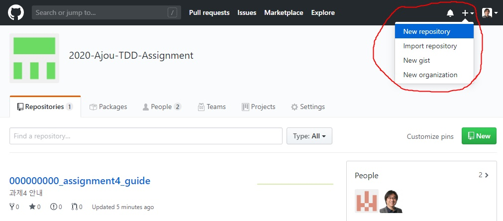
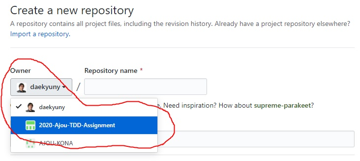

# 000000000_assignment4_guide
## 과제4 제출 안내

### 개요
* 5월4일 TDD 특강 수강 후 각자 리포지토리를 생성, 여기에 특강시간에 진행한 볼링게임 스코어 계산 예제를 하나 하나 따라 진행함.
* 각 단계별 진행할 때 마다 커밋을 수행 TDD기반 개발 및 리팩토링을 직접 경험하도록 하는 것이 주 목적임.

### Repositoy 생성 가이드
* 우측상단의 "+" 마크 클릭하여 New Repository 선택

* 만일 다수 Owner가 나올 경우 **반드시** "2020-Ajou-TDD-Assignment" 선택

### 유의사항
* 리포지토리 명은 반드시 **"학번_영문이름"** 으로 함.
예를 들어 **"201610174_yoon_daekyun"**.
* 별도 브랜치는 만들지 말고 모두 마스터에 커밋.

### 제출기한(작업완료 기한)
2020년 5월8일
